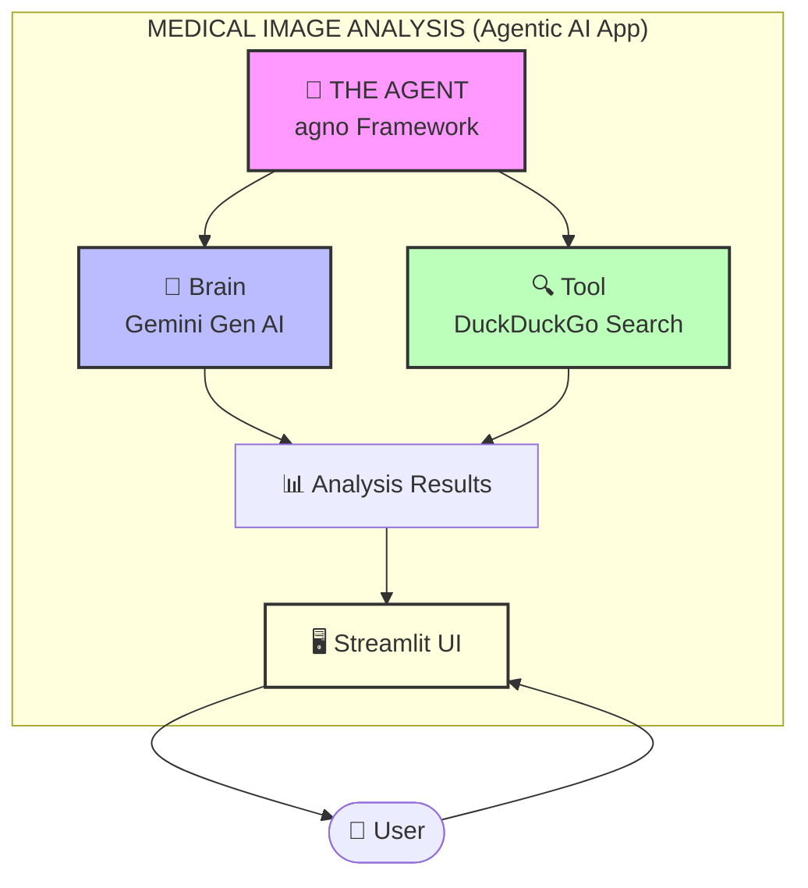

# Medical Image Analysis Agent

An **agentic AI system** that analyzes medical images (X-rays, CT scans, MRIs) 
using Google's Gemini models and provides structured diagnostic reports with 
research-backed context.

## Features
- 🤖 **AI Agent** powered by Gemini 2.5 Flash
- 🔍 **Tool use**: DuckDuckGo search for medical literature
- 🖼️ **Multimodal**: Processes medical images directly
- 📊 **Structured output**: 5-part diagnostic framework

## 🏗️ System Architecture

